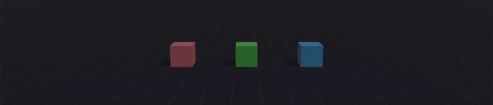

Три бокса:

- красный
- зеленый
- синий

Зеленый бокс управляющий.
При нажатии клавиши ```ВЛЕВО``` он сталкивается с красным.
При нажатии клавиши ```ВПРАВО``` он сталкивается с синим.

После коллизии, переменной ```start``` левого или правого бокса присваивается ```true```.
Стейт-машина реагирует на это изменение переходом в состояние ```Box Moved```.

```json
{
  "@class": "CompareTrigger",
  "id": {
    "uuid": "4B67CF18-32E9-4B41-A36F-AAF4A86FDFA8"
  },
  "ownerScriptId": {
    "uuid": "A55F04A2-DB41-49D0-81FD-0D32742B2F20"
  },
  "logicOperation": 0,
  "resultType": 0,
  "isInverted": false,
  "operation": "==",
  "eventType": "result_true_started",
  "leftOperand": "object__2DF29F1F_5456_4BE1_8855_BDC86880A40D__start",
  "rightOperand": "true"
}
```

А соответствующая анимация ```Animation - Color``` при состоянии ```Box Moved``` окрашивает бокс в желтый цвет.

Две стейт-машины используют один и тот же ресурс с ID ```35159300-637A-4B13-A647-59E808ECA54E```.

```json
{
  "@class": "BaseNode",
  "object3D": {
    "@class": "BaseObject3D",
    "id": {
      "uuid": "DA15CA4B-C43B-43E3-A892-A674CE2B6E0E"
    },
    "name": "State machine - Left",
    "enabled": true,
    "visible": true,
    "hitVisible": true,
    "stateMachine": {
      "@class": "BaseComponentStateMachine",
      "stateMachineId": {
        "uuid": "35159300-637A-4B13-A647-59E808ECA54E"
      },
      "saveState": false,
      "mappingProvider": {
        "@class": "IdPoolBase",
        "prototypeToInstanceMap": [
          {
            "key": {
              "uuid": "2DF29F1F-5456-4BE1-8855-BDC86880A40D"
            },
            "value": {
              "uuid": "EF6389C8-0264-4602-A6FF-655DD548672F"
            }
          }
        ]
      }
    },
    "transform": {
      "@class": "BaseComponentTransformable",
      "localTransforms": {
        "values": [
          1, 0, 0, 0, 
          0, 1, 0, 0, 
          0, 0, 1, 0, 
          3, -0.5, 0, 1
        ]
      }
    },
    "metadata": {
      "importedIdentifier": "",
      "importedName": "",
      "isBone": false,
      "tags": [],
      "tagVariables": []
    }
  }
},
```

```json
{
  "@class": "BaseNode",
  "object3D": {
    "@class": "BaseObject3D",
    "id": {
      "uuid": "2F5F659A-B215-4FEE-AAD6-6368F10525E1"
    },
    "name": "State machine - Right",
    "enabled": true,
    "visible": true,
    "hitVisible": true,
    "stateMachine": {
      "@class": "BaseComponentStateMachine",
      "stateMachineId": {
        "uuid": "35159300-637A-4B13-A647-59E808ECA54E"
      },
      "saveState": false,
      "mappingProvider": {
        "@class": "IdPoolBase",
        "prototypeToInstanceMap": [
          {
            "key": {
              "uuid": "2DF29F1F-5456-4BE1-8855-BDC86880A40D"
            },
            "value": {
              "uuid": "4511A32C-518E-4554-810A-8AE2C9040684"
            }
          }
        ]
      }
    },
    "transform": {
      "@class": "BaseComponentTransformable",
      "localTransforms": {
        "values": [
          1, 0, 0, 0, 
          0, 1, 0, 0, 
          0, 0, 1, 0, 
          -3, -0.5, 0, 1
        ]
      }
    },
    "metadata": {
      "importedIdentifier": "",
      "importedName": "",
      "isBone": false,
      "tags": [],
      "tagVariables": []
    }
  }
},
```